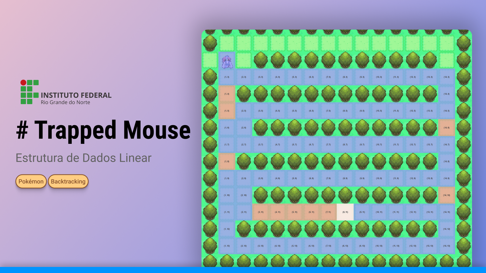

<p align="center">
  
</p>

# Passo a Passo do Trapped Mouse

## 1. Leitura do Labirinto (builder.py):

- A lógica de leitura do labirinto é implementada no arquivo `builder.py`.
- O `argparse` é utilizado para ler as linhas de um arquivo `.txt` passado pelo terminal, identificando paredes, chão, saída, e a posição inicial do rato.
- Esses parâmetros são configuráveis no arquivo `config.py`.
- Caso seja identificado um labirinto inválido, uma exceção é evocada e o programa é encerrado.
- Com todas as configurações corretas, uma instância do labirinto é criada, contendo informações como labirinto completo, linhas, colunas, coordenadas do rato e da saída.

## 2. Lógica da Classe Maze e Algoritmo de Busca (maze.py):

- A lógica central está na classe `Maze` em `maze.py`, onde o labirinto é efetivamente iniciado, e o algoritmo de busca em profundidade (backtracking) é implementado.
- O método `find_path()` é chamado para determinar se existe um caminho até a saída.

## 3. Funcionamento do Algoritmo de Busca:

- Verifica se a posição atual é a saída, marcando `found` como `True` e encerrando o algoritmo.
- Empilha a posição atual na pilha de caminhos visitados e define os movimentos possíveis (direita, esquerda, cima, baixo).
- Para cada movimento, verifica se a nova posição é válida (dentro dos limites do labirinto, não é uma parede, e não foi visitada anteriormente).
- Se a nova posição for válida, empilha na pilha do caminho correto e chama a função recursivamente com a nova posição.
- Se o caminho for encontrado, interrompe a recursividade.
- Se a recursão não encontrar o caminho, remove o último movimento da pilha de caminho correto.

## 4. Renderização do Labirinto (main.py):

- Na função principal, é determinado se o labirinto é médio ou grande, aplicando um fator de escala correspondente.
- As posições inicial do rato (`player_pos`) e da saída (`lugia_pos`) são multiplicadas pelo fator de escala para renderizar corretamente.
- Inicia o `game_loop`.

## 5. Game Loop:

- Inicializa uma instância do Pygame, carrega os assets, define a fonte, contador e condição de parada.
- Carrega o loop principal definindo delta time e velocidade de movimento.
- Verifica se a pilha de movimentos não está vazia.
- Define o próximo passo do jogador com base no topo da pilha.
- Calcula a direção do movimento e atualiza a posição do jogador.
- Verifica as sprites com base na direção relativa de x e y, incrementa o contador para animação mais suave.
- Se o próximo ponto é alcançado, move da pilha de movimentos corretos para o array de caminho (para ser renderizado ao final do labirinto).
- Verifica se o jogador alcançou a saída, encerra a música de fundo e toca uma música de celebração.
- Renderiza o jogo com a função `render_game`, passando as posições atuais dos elementos, incluindo os caminhos incorretos (vermelho), corretos (azul) e a posição inicial (branco).

# Como executar

```bash
# Caminho /dfs-lugia-hunt

# Linux
python -m venv .venv
source .venv/bin/activate

# Windows
py -m venv .venv
.venv/Scripts/Activate

pip install -r requirements.txt

# Linux
python main.py -f mazes/nome_labirinto.txt

# Windows
py main.py -f mazes/nome_labirinto.txt
```

# Considerações finais

Este algoritmo de busca em profundidade é utilizado para encontrar caminhos válidos e inválidos. Além disso, o projetei com Pygame e assets de Pokémon Platinum e Pokémon Soul Silver para disponibilizar uma experiência mais exclusiva com feedback visual e sonoro.

# Créditos

- [Spritesheet do personagem Lucas (Pokémon Platinum)](https://www.spriters-resource.com/ds_dsi/pokemonplatinum/sheet/47489/)
- [Spritesheet do Lugia (Pokémon Soul Silver)](https://www.spriters-resource.com/ds_dsi/pokemonheartgoldsoulsilver/sheet/26795/)
- [Tiles do mundo (árvores, caminho, etc)](https://www.deviantart.com/aurumdeluxe/art/Platinum-Overworld-Tiles-WIP-532401706)
